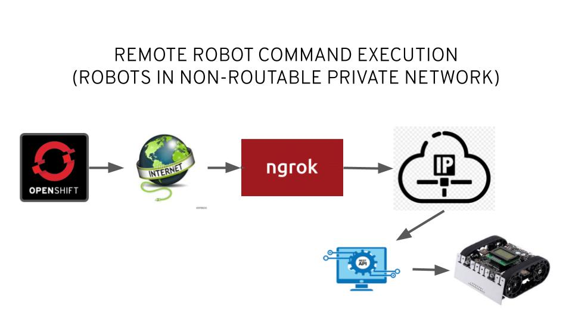

# robotService

## This is one of the components in the Robot Demo involving MQTT, Fuse Online, AMQ Streams (Kafka) and physical robots. You can think of it as an agent which allows you to control the robots in a private network from Openshift running in the cloud on the Internet.

Here is the setup:
 

## Deployment

This is meant to be run in the same private non-routable network as you robots and not intended to run on Openshift.

* modify the robotNames hashmap in CommandEnpoin.java to associate the correct IP address with each robot
* mvn clean spring-boot:run
* start ngrok tunnel to allow access to your robotService from the Internet
